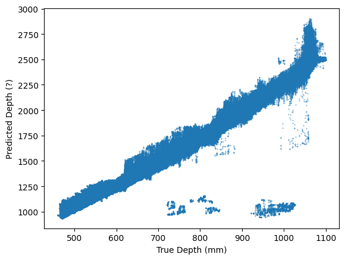

# BoxDepth

A monocular metric depth estimation approach for box interior images leveraging depth estimation priors.

## 引言

现有的单目图像深度估计模型，其在不经过微调或特定场景数据集训练的情况下，通常存在不同程度的尺度偏差问题，导致其估计结果和实际深度差异较大，难以直接应用到视觉测量系统中。本方法利用深度估计模型输出的具有尺度偏差的相对深度，结合**相机内参**和**箱体的物理尺寸**，估计图像中箱体内壁各部分在相机坐标系下的深度值。相关方法已获得中国国家知识产权局授权发明专利（[CN119648771A](https://patents.google.com/patent/CN119648771A/en?oq=CN119648771A)）。

### 预先准备数据

* 相机内参（可通过标定获得）
* 箱体尺寸（长、宽、高）
* 相机成像平面距箱体底面距离
* 箱体图片（要求相机光学中心与箱体底部几何中心尽可能对正）

### Step 1：使用一个深度估计模型预测出相对深度值

要求该深度估计结果应和实际深度成近似的线性关系：


你可以使用Depth Pro或DepthAnything v2（metric depth版本），他们本应预测出metric depth，但是他们预测出的结果与实际深度值存在不可避免的尺度偏移，该偏移的大小不影响本方法结果结果。

### Step 2：根据预测深度图生成点云

深度图到点云的反投影公式为：

$$
\begin{bmatrix}
x_c \\
y_c \\
z_c
\end{bmatrix}
=
z_c\,K^{-1}
\begin{bmatrix}
u \\
v \\
1
\end{bmatrix}
$$

其中，$(u,v)$ 为像素坐标，$z_c$ 为该像素的深度值，$K$是相机内参,定义为

$$
K=
\begin{bmatrix}
f_x&\alpha&u_0 \\
0&f_y&v_0 \\
0&0&1
\end{bmatrix}
$$

可以使用Open3D库的 `o3d.geometry.PointCloud.create_from_depth_image(depth, intrinsics)`实现深度图向点云的转换。

### Step3：根据点云计算各个像素点的法向量，并依据法向量分割平面

该步骤可通过Open3D的 `pcd.estimate_normals(search_param=o3d.geometry.KDTreeSearchParamHybrid(radius=rad, max_nn=neighbor))`函数实现，其原理主要为通过KNN拟合平面。

理想情况下，箱体（俯视视角下）前、后、左、右、底面五个侧面的法向量应分别为 `(0,-1,0)、(0,1,0)、(-1,0,0)、(1,0,0)、(0,0,1)`，然而由于预测深度图结果有瑕疵，各像素点的法向量不会完全与之相等，计算每个像素点的法向量与这五个平面法向量的余弦相似性，去相似性最大者确定该像素点所属平面：

$$
{CosineSimilarity}
=
\cos\langle \mathbf{n}_{\text{pixel}}, \mathbf{n}_{s} \rangle
=
\frac{\mathbf{n}_{\text{pixel}} \cdot \mathbf{n}_{s}}
{\Vert \mathbf{n}_{\text{pixel}} \Vert \, \Vert \mathbf{n}_{s} \Vert}
$$

### Step4：

根据相机成像模型，图像坐标系下的点与世界坐标系下的点存在如下对应关系：

$$
z_c
\begin{bmatrix}
u \\
v \\
1
\end{bmatrix}
=
\begin{bmatrix}
K & 0
\end{bmatrix}
\begin{bmatrix}
R & T \\
0 & 1
\end{bmatrix}
\begin{bmatrix}
x_w \\
y_w \\
z_w \\
1
\end{bmatrix}
$$

即

$$
\begin{bmatrix}
x_w \\
y_w \\
z_w
\end{bmatrix}
=
R^{-1}\left( K^{-1}
\begin{bmatrix}
u \\
v \\
1
\end{bmatrix}
z_c - T \right)
$$

其中，$(u,v)$ 是像素点的图像坐标；$z_c$ 是相机成像平面到实际物体的距离，本方法下即为预测深度值，即 $z_c=\text{depth}_{\text{pred}}$；$R$ 和 $T$ 是相机外参矩阵的旋转矩阵和位移向量，分别代表相机坐标系与世界坐标系之间的旋转和位移参数。为简化计算，本方法假定世界坐标系与相机坐标系重合（均为 $O'-xyz$），因此有

$$
R=
\begin{bmatrix}
1&0&0 \\
0&1&0 \\
0&0&1
\end{bmatrix},
\quad
T=
\begin{bmatrix}
0 \\
0 \\
0
\end{bmatrix}
$$

$K$ 是相机的内参矩阵。

将图像上的每一个像素同相机的光学中心连线，该直线记为 $r(u,v,z_c)$，记 $R^{-1}K^{-1}=A(a_{ij})$，$-R^{-1}T=B(b_i)$，直线 $r(u,v,z_c)$ 的方程为：

$$
r(u,v,z_c)=\begin{cases}
x_w=(a_{11}u+a_{12}v+a_{13})z_c+b_1 \\
y_w=(a_{21}u+a_{22}v+a_{23})z_c+b_2 \\
z_w=(a_{31}u+a_{32}v+a_{33})z_c+b_3
\end{cases}
$$

箱体内部长度（length）、宽度（width）已知，可将前后左右四个内壁视为世界坐标系下四个已知平面，其方程分别为：

$$
\begin{aligned}
P_{\text{left}}:&\ y_w=\frac{\text{length}}{2} \\
P_{\text{right}}:&\ y_w=-\frac{\text{length}}{2} \\
P_{\text{front}}:&\ x_w=\frac{\text{width}}{2} \\
P_{\text{back}}:&\ x_w=-\frac{\text{width}}{2}
\end{aligned}
$$

将这四个面的方程与上述直线方程联立，可以得到交点坐标 $z_w$，其意义为图像上该点对应的像素点距离相机成像平面的距离，这实际上就是该点的真实深度，表示为：

$$
\begin{aligned}
	{depth}_{\text{left}}&=\frac{\text{length}/2-b_1}{a_{11}u+a_{12}v+a_{13}} \\
	{depth}_{\text{right}}&=\frac{-\text{length}/2-b_1}{a_{11}u+a_{12}v+a_{13}} \\
	{depth}_{\text{front}}&=\frac{\text{width}/2-b_2}{a_{21}u+a_{22}v+a_{23}} \\{depth}_{\text{back}}&=\frac{-\text{width}/2-b_2}{a_{21}u+a_{22}v+a_{23}}
\end{aligned}
$$

由于箱体底面与相机成像平面之间的距离（height）为已知量，则笼子底面区域深度满足：

$$
{depth}_{\text{bottom}}=\text{height}
$$


## 致谢

本项目中部分代码来Depth Pro

```
@inproceedings{Bochkovskii2024:arxiv,
  author     = {Aleksei Bochkovskii and Ama\"{e}l Delaunoy and Hugo Germain and Marcel Santos and
               Yichao Zhou and Stephan R. Richter and Vladlen Koltun},
  title      = {Depth Pro: Sharp Monocular Metric Depth in Less Than a Second},
  booktitle  = {International Conference on Learning Representations},
  year       = {2025},
  url        = {https://arxiv.org/abs/2410.02073},
}
```
