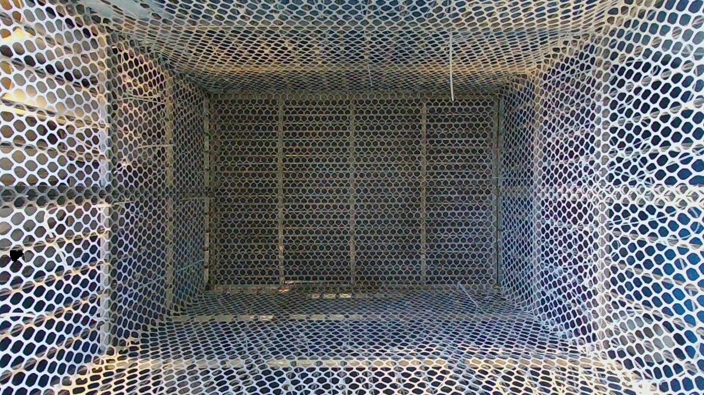
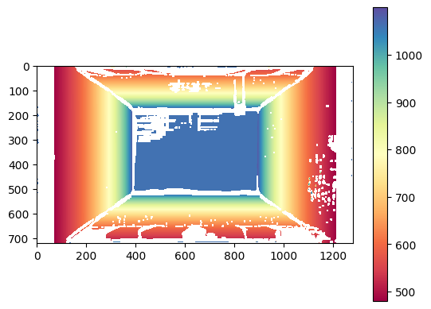

# BoxDepth

A monocular metric depth estimation approach for box interior images leveraging depth estimation priors.

## 引言

现有的单目图像深度估计模型，其在不经过微调或特定场景数据集训练的情况下，通常存在不同程度的尺度偏差问题，导致其估计结果和实际深度差异较大，难以直接应用到视觉测量系统中。本方法利用深度估计模型输出的具有尺度偏差的相对深度，结合**相机内参**和**箱体的物理尺寸**，估计图像中箱体内壁各部分在相机坐标系下的深度值。相关方法已获得中国国家知识产权局授权发明专利（[CN119648771A](https://patents.google.com/patent/CN119648771A/en?oq=CN119648771A)）。

<table align="center" style="margin: 0 auto;">
  <tr>
    <td align="center">
      
    </td>
    <td align="center">
      
    </td>
  </tr>
  <tr>
    <td align="center">
      输入图片
    </td>
    <td align="center">
      深度计算结果
    </td>
  </tr>
</table>

### 预先准备数据

* **相机内参**（可通过标定获得）
* **箱体尺寸**（长、宽、高）
* **相机成像平面距箱体底面距离**
* **箱体图片**（要求相机光学中心与箱体底部几何中心尽可能对正）

### Step 1：使用一个深度估计模型预测出相对深度值

要求该深度估计结果应和实际深度成近似的线性关系：

<p align="center">
  
</p>

你可以使用 Depth Pro 或 DepthAnything v2（metric depth 版本），它们本应预测出 metric depth，但其结果与实际深度值仍存在不可避免的尺度偏移。

### Step 2：根据预测深度图生成点云

深度图到点云的反投影公式为：

$$
\begin{bmatrix} x_c \\\\ y_c \\\\ z_c \end{bmatrix} = z_c K^{-1} \begin{bmatrix} u \\\\ v \\\\ 1 \end{bmatrix}
$$

其中，$(u,v)$ 为像素坐标，$z_c$ 为该像素的深度值，$K$ 是相机内参，定义为：

$$
K = \begin{bmatrix} f_x & \alpha & u_0 \\\\ 0 & f_y & v_0 \\\\ 0 & 0 & 1 \end{bmatrix}
$$

可以使用 Open3D 库的 `o3d.geometry.PointCloud.create_from_depth_image(depth, intrinsics)` 实现转换。

### Step 3：根据点云计算各个像素点的法向量，并依据法向量分割平面

理想情况下，箱体（俯视视角）前、后、左、右、底面五个侧面的法向量应分别为 $(0,-1,0)$、 $(0,1,0)$、 $(-1,0,0)$、 $(1,0,0)$、 $(0,0,1)$。通过计算每个像素点的法向量与这五个基准法向量的**余弦相似度**来确定该像素所属平面：

$$
\text{CosineSimilarity} = \cos\langle \mathbf{n}_{\text{pixel}}, \mathbf{n}_{s} \rangle = \frac{\mathbf{n}_{\text{pixel}} \cdot \mathbf{n}_{s}}{\|\mathbf{n}_{\text{pixel}}\| \|\mathbf{n}_{s}\|}
$$

### Step 4：映射真实深度

根据相机成像模型，图像坐标系下的点与世界坐标系下的点存在如下对应关系：

$$
z_c \begin{bmatrix} u \\\\ v \\\\ 1 \end{bmatrix} = \begin{bmatrix} K & 0 \end{bmatrix} \begin{bmatrix} R & T \\\\ 0 & 1 \end{bmatrix} \begin{bmatrix} x_w \\\\ y_w \\\\ z_w \\\\ 1 \end{bmatrix}
$$

推导得：

$$
\begin{bmatrix} x_w \\\\ y_w \\\\ z_w \end{bmatrix} = R^{-1} \left( K^{-1} \begin{bmatrix} u \\\\ v \\\\ 1 \end{bmatrix} z_c - T \right)
$$

为简化计算，本方法假定世界坐标系与相机坐标系重合。记 $R^{-1}K^{-1} = A(a_{ij})$，$-R^{-1}T = B(b_i)$，过像素点的射线直线方程为：

$$
\begin{cases} x_w = (a_{11}u + a_{12}v + a_{13})z_c + b_1 \\\\ y_w = (a_{21}u + a_{22}v + a_{23})z_c + b_2 \\\\ z_w = (a_{31}u + a_{32}v + a_{33})z_c + b_3 \end{cases}
$$

箱体内部长度（length）、宽度（width）已知，四个内壁平面方程为：

$$
\begin{aligned} P_{\text{left}}: & \quad y_w = \frac{\text{length}}{2} \\\\ P_{\text{right}}: & \quad y_w = -\frac{\text{length}}{2} \\\\ P_{\text{front}}: & \quad x_w = \frac{\text{width}}{2} \\\\ P_{\text{back}}: & \quad x_w = -\frac{\text{width}}{2} \end{aligned}
$$

将平面方程与射线方程联立，解出的 $z_c$ 即为该像素点的**真实深度**：

$$
\begin{aligned} \text{depth}_{\text{left}} &= \frac{\text{length}/2 - b_2}{a_{21}u + a_{22}v + a_{23}} \\\\ \text{depth}_{\text{right}} &= \frac{-\text{length}/2 - b_2}{a_{21}u + a_{22}v + a_{23}} \\\\ \text{depth}_{\text{front}} &= \frac{\text{width}/2 - b_1}{a_{11}u + a_{12}v + a_{13}} \\\\ \text{depth}_{\text{back}} &= \frac{-\text{width}/2 - b_1}{a_{11}u + a_{12}v + a_{13}} \end{aligned}
$$

由于箱体底面与相机的距离（height）已知，则底面区域深度为：

$$
\text{depth}_{\text{bottom}} = \text{height}
$$

## 致谢

本项目中部分代码来自 Depth Pro。

```bibtex
@inproceedings{Bochkovskii2024:arxiv,
  author    = {Aleksei Bochkovskii and Ama\"{e}l Delaunoy and Hugo Germain and Marcel Santos and
               Yichao Zhou and Stephan R. Richter and Vladlen Koltun},
  title     = {Depth Pro: Sharp Monocular Metric Depth in Less Than a Second},
  booktitle  = {International Conference on Learning Representations},
  year       = {2025},
  url        = {[https://arxiv.org/abs/2410.02073](https://arxiv.org/abs/2410.02073)},
}